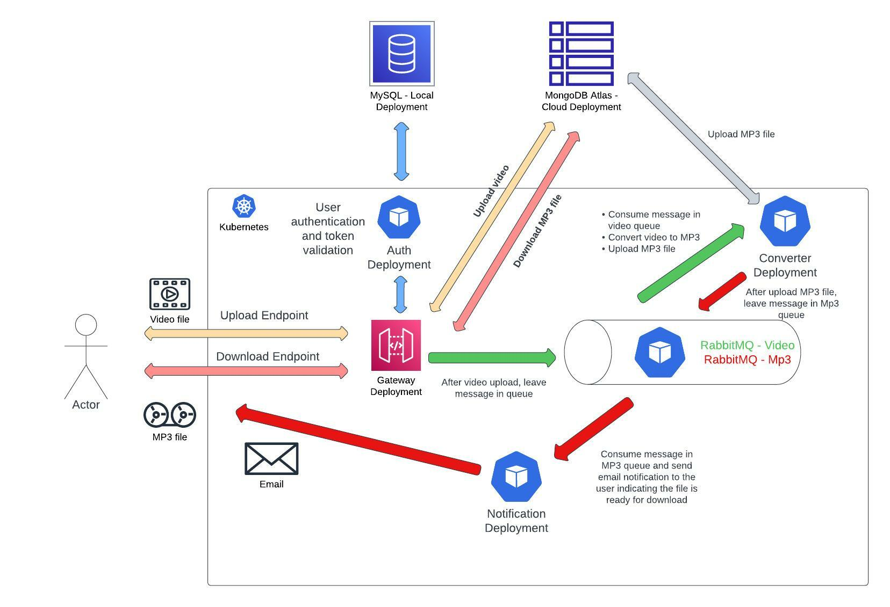

# SYSTEM DESIGN - KUBERNETES

This is a project from the tutorial https://www.youtube.com/watch?v=hmkF77F9TLw&t=16165s
with some changes.

- Use of MySQL with virtual machine IP address
- Use of MongoDB Atlas for cloud storage
- Modifications in deployment files

**This is the general schema**

The intention of this repository is to act as a guide for future references
